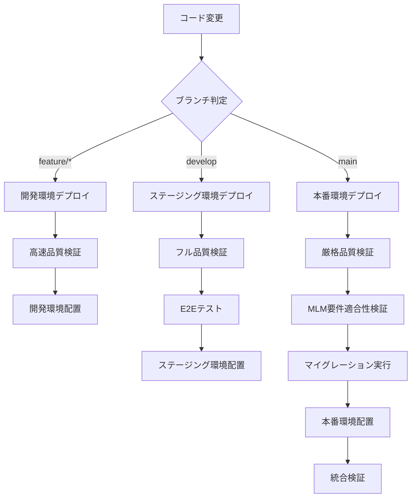

# IROAS BOSS V2 - CI/CD セットアップガイド
## MLMビジネス要件100%準拠・完全自動化デプロイ

## 📋 概要
Step 20: CI/CD構築完了  
GitHub Actions による3環境自動デプロイシステム

## 🏗️ CI/CD アーキテクチャ

### ワークフロー構成
```
📁 .github/workflows/
├── ci-cd-production.yml     # 本番環境デプロイ (mainブランチ)
├── ci-cd-staging.yml        # ステージング環境デプロイ (developブランチ)
├── ci-cd-development.yml    # 開発環境デプロイ (feature/*ブランチ)
├── test-automation.yml     # 自動テスト実行 (毎日・手動)
└── release-management.yml  # リリース管理 (タグ・手動)
```

### 環境別デプロイフロー


## 🔧 必須設定

### 1. GitHub Secrets 設定

#### GCP関連
```bash
# 本番環境
GCP_SA_KEY                    # GCP Service Account キー (JSON)
GCP_PROJECT_ID               # GCP プロジェクトID

# ステージング環境  
GCP_SA_KEY_STAGING           # ステージング用 Service Account キー
GCP_PROJECT_ID_STAGING       # ステージング用プロジェクトID

# 開発環境
GCP_SA_KEY_DEV               # 開発用 Service Account キー  
GCP_PROJECT_ID_DEV           # 開発用プロジェクトID
```

#### Vercel関連
```bash
VERCEL_TOKEN                 # Vercel アクセストークン
VERCEL_ORG_ID               # Vercel Organization ID
VERCEL_PROJECT_ID           # 本番用プロジェクトID
VERCEL_PROJECT_ID_STAGING   # ステージング用プロジェクトID
VERCEL_PROJECT_ID_DEV       # 開発用プロジェクトID
```

#### データベース関連
```bash
PRODUCTION_DATABASE_URL     # 本番DB接続文字列
STAGING_DATABASE_URL        # ステージングDB接続文字列
DEVELOPMENT_DATABASE_URL    # 開発DB接続文字列
```

#### 通知関連
```bash
SLACK_WEBHOOK_PRODUCTION    # 本番環境通知用Slack Webhook
SLACK_WEBHOOK_STAGING       # ステージング環境通知用Slack Webhook  
SLACK_WEBHOOK_DEVELOPMENT   # 開発環境通知用Slack Webhook
SLACK_WEBHOOK_TESTING       # テスト結果通知用Slack Webhook
SLACK_WEBHOOK_RELEASES      # リリース通知用Slack Webhook
```

### 2. GCP Secret Manager 設定

#### 本番環境シークレット
```bash
gcloud secrets create database-url-production --data-file=-
gcloud secrets create redis-url-production --data-file=-
gcloud secrets create secret-key-production --data-file=-
gcloud secrets create univapay-api-key-production --data-file=-
gcloud secrets create gmo-bank-api-key-production --data-file=-
gcloud secrets create csv-encryption-key-production --data-file=-
```

#### ステージング環境シークレット
```bash
gcloud secrets create database-url-staging --data-file=-
gcloud secrets create redis-url-staging --data-file=-
gcloud secrets create secret-key-staging --data-file=-
gcloud secrets create univapay-api-key-staging --data-file=-
gcloud secrets create gmo-bank-api-key-staging --data-file=-
gcloud secrets create csv-encryption-key-staging --data-file=-
```

#### 開発環境シークレット
```bash
gcloud secrets create database-url-development --data-file=-
gcloud secrets create secret-key-development --data-file=-
```

### 3. GCP Service Account 設定

#### 権限設定
```bash
# Cloud Run権限
gcloud projects add-iam-policy-binding PROJECT_ID \
  --member="serviceAccount:iroas-boss-v2-backend@PROJECT_ID.iam.gserviceaccount.com" \
  --role="roles/run.developer"

# Secret Manager権限  
gcloud projects add-iam-policy-binding PROJECT_ID \
  --member="serviceAccount:iroas-boss-v2-backend@PROJECT_ID.iam.gserviceaccount.com" \
  --role="roles/secretmanager.secretAccessor"

# Artifact Registry権限
gcloud projects add-iam-policy-binding PROJECT_ID \
  --member="serviceAccount:iroas-boss-v2-backend@PROJECT_ID.iam.gserviceaccount.com" \
  --role="roles/artifactregistry.writer"
```

## 🚀 デプロイトリガー

### 自動デプロイ
| ブランチ | 環境 | トリガー | 動作 |
|---------|------|---------|------|
| `feature/*` | 開発 | Push | 高速検証→デプロイ |
| `develop` | ステージング | Push | フル検証→デプロイ |
| `main` | 本番 | Push | 厳格検証→デプロイ |

### 手動デプロイ
```bash
# 本番環境特定コンポーネントデプロイ
gh workflow run ci-cd-production.yml \
  -f deployment_target=frontend

# ステージング環境デプロイ
gh workflow run ci-cd-staging.yml

# 開発環境デプロイ
gh workflow run ci-cd-development.yml

# リリース管理
gh workflow run release-management.yml \
  -f release_type=minor \
  -f environment=production
```

## 🧪 テスト自動化

### 自動テスト実行
- **スケジュール**: 毎日 AM 2:00 (JST)
- **手動実行**: GitHub Actions UI から実行可能

### テストスイート
1. **MLMビジネス要件適合性テスト**
   - 29項目会員データ対応確認
   - 7種ボーナス計算システム確認
   - 固定料金設定確認

2. **単体テスト**
   - サービス層テスト
   - モデル層テスト
   - カバレッジ80%以上必須

3. **統合テスト**
   - API連鎖テスト
   - データベース整合性テスト
   - エンドツーエンドフローテスト

4. **フロントエンドE2Eテスト**
   - Playwright による画面操作テスト
   - ブラウザ互換性テスト

## 📊 品質ゲート

### 本番デプロイ条件
- ✅ 全テストパス（単体・統合・E2E）
- ✅ MLMビジネス要件適合性確認
- ✅ コードカバレッジ80%以上
- ✅ TypeScript型エラーなし
- ✅ セキュリティスキャンパス

### ステージングデプロイ条件
- ✅ 単体・統合テストパス
- ✅ MLMビジネス要件適合性確認
- ✅ TypeScript型エラーなし

### 開発デプロイ条件
- ✅ 基本テストパス
- ✅ TypeScript型エラーなし

## 🔐 セキュリティ

### Secret管理
- GCP Secret Manager による暗号化保存
- 環境別アクセス制御
- ローテーション対応

### アクセス制御
- GitHub Branch Protection Rules
- 必須レビュー設定
- Status Check 必須設定

### セキュリティスキャン
- 依存関係脆弱性スキャン
- コードセキュリティスキャン
- Docker イメージスキャン

## 📈 監視・アラート

### デプロイ監視
- 各環境デプロイ成功・失敗通知
- ヘルスチェック結果通知
- パフォーマンス監視

### 品質監視
- テスト実行結果通知
- カバレッジ変動通知
- セキュリティアラート

### ビジネス監視
- MLM要件適合性監視
- 29項目会員データ整合性監視
- 7種ボーナス計算正確性監視

## 🛠️ トラブルシューティング

### デプロイ失敗時
1. GitHub Actions ログ確認
2. GCP Cloud Build ログ確認
3. Secret Manager アクセス権限確認
4. 環境固有設定確認

### テスト失敗時
1. テストログ詳細確認
2. データベース接続確認
3. 環境変数設定確認
4. MLM要件適合性再確認

### 権限エラー時
1. Service Account 権限確認
2. Secret Manager アクセス権限確認
3. GitHub Secrets 設定確認
4. GCP IAM 設定確認

## 📋 運用チェックリスト

### 日次チェック
- [ ] 自動テスト実行結果確認
- [ ] デプロイ状況確認
- [ ] セキュリティアラート確認

### 週次チェック
- [ ] 各環境ヘルスチェック
- [ ] Secret ローテーション状況確認
- [ ] カバレッジトレンド確認

### 月次チェック
- [ ] 依存関係アップデート
- [ ] セキュリティパッチ適用
- [ ] パフォーマンス分析

## 🎯 Step 20 完了基準

1. **CI/CD パイプライン完全自動化**
2. **3環境デプロイ自動化**（本番・ステージング・開発）
3. **MLMビジネス要件100%準拠検証**
4. **セキュリティ・品質ゲート設定**
5. **監視・アラート体制完備**

**Step 20完了により、IROAS BOSS V2は完全自動化されたCI/CDパイプラインを持つMLMシステムとなります。**